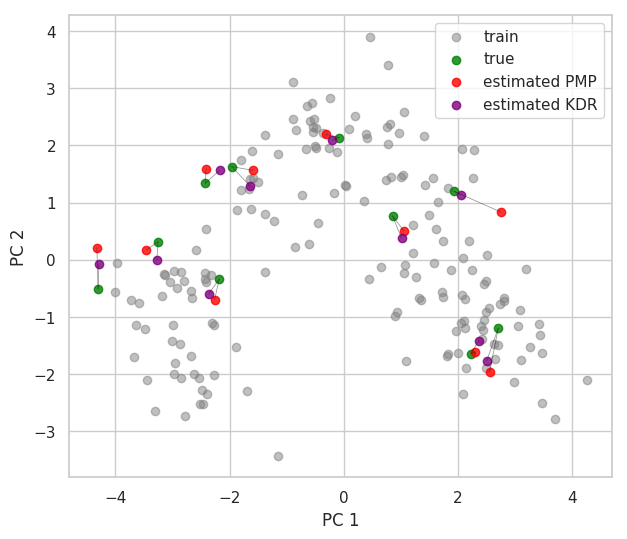
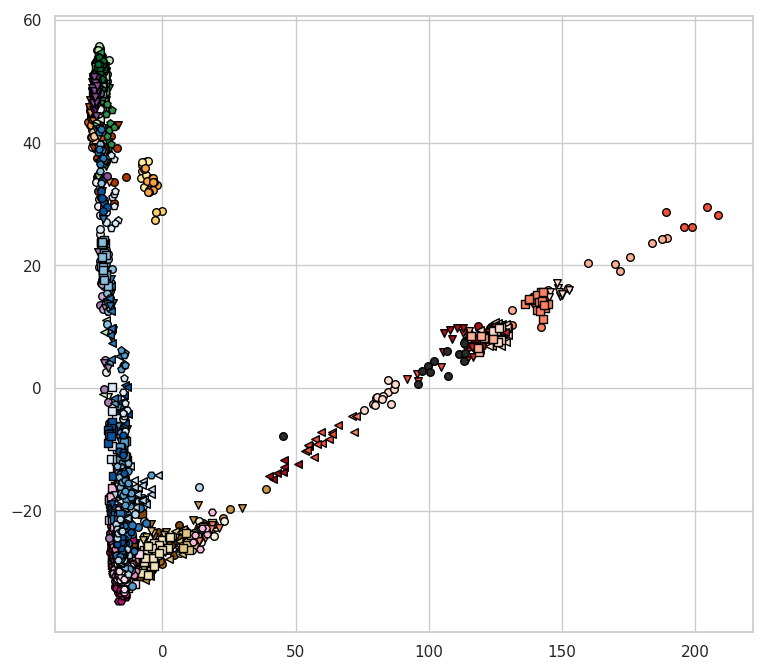
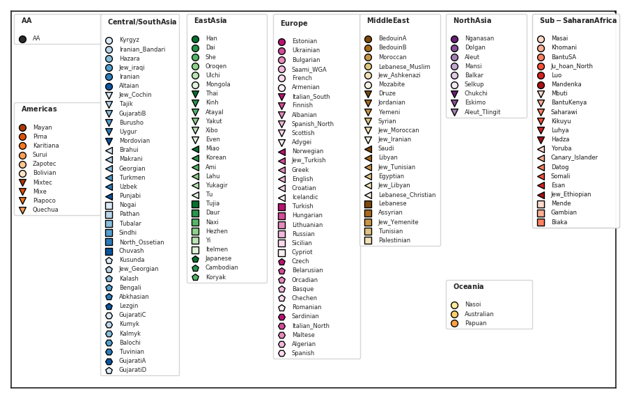
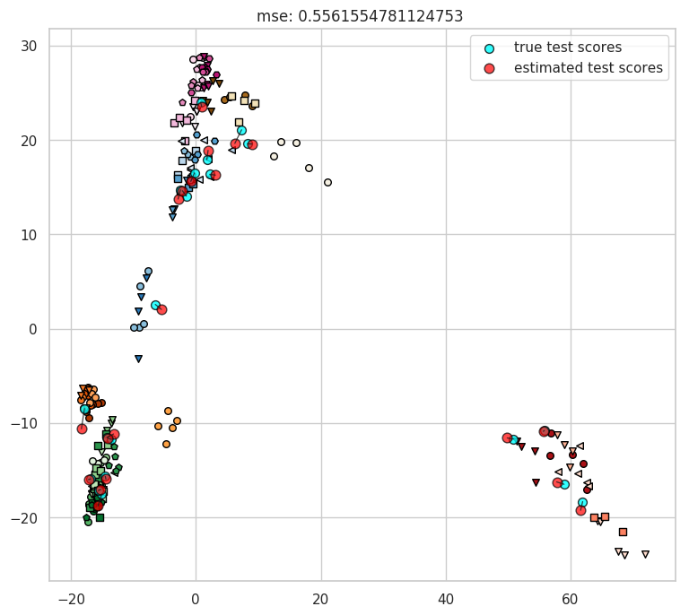
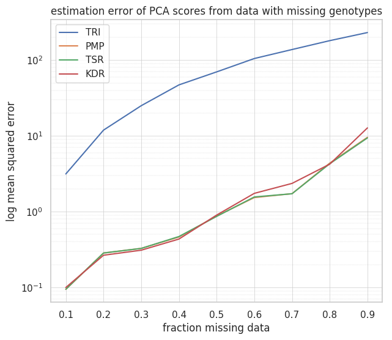

# mpca
methods to handle missing data in PCA


Problem
=======

mpca contains implementations of various methods to solve the following general problem:

<div style="border:1px solid black; padding:10px;">


Given a PCA model that has been defined on a train set **X**

and

a new sample **z**, with some variables missing:

estimate scores **t'** for **z** using the same PCA model

s.t. the difference **t'** - **t** is minimized

where **t** are the true scores of **z**

(true scores defined as the scores obtained from the PCA model when all data of **z** is observed)

</div>


Methods
=======

### Least-squares based methods

* Projection to the Model Plane (PMP)
* Trimmed Score Regression (TSR)
* Known Data Regression (KDR)

><font size="-1">Detailed descriptions of these in e.g.</font>

><font size="-1">**Dealing with missing data in MSPC: several methods, different interpretations, some examples**
Francisco Arteaga ,  Alberto Ferrer
JOURNAL OF CHEMOMETRICS
2002</font>

><font size="-1">**Missing data methods in PCA and PLS: Score calculations with incomplete observations**
Philip R.C.Nelson Paul A.Taylor John F.MacGregor
Chemometrics and Intelligent Laboratory Systems
1996</font>


Examples
========

### Simple example

>see [examples/simple_example.py](examples/simple_example.py) for full code

Load a dataset and randomly select 10 samples for the test set:
```python
dataset = datasets.load_wine()
n_test_samples = 10
test_idx = np.random.choice(dataset.data.shape[0], size=n_test_samples, replace=False)
train_idx = np.arange(dataset.data.shape[0])
train_idx = np.delete(train_idx, test_idx)

X = dataset.data[train_idx]
z = dataset.data[test_idx]
```

Normalize data and define a PCA model:
```python
scaler = StandardScaler()
scaler.fit(X)
X = scaler.transform(X)
z = scaler.transform(z)

pm = pcamodel()
pm.define_PCA_model(X)

scores_X = pm.scores
scores_z_true = np.dot(z, pm.loadings)
```

Create sparse data by randomly setting 25% of variables to missing:
```python
z_sparse = remove_values(z, 0.25)
```


Estimate scores for sparse data using PMP and KDR methods:
```python
scores_pmp = projection_to_model_plane(pm, z_sparse)
scores_kdr = known_data_regression(pm, X, z_sparse)
```


Estimated scores of samples with missing data using the PMP and KDR methods on the wine dataset:



### Example on genotype data

>see  [examples/eigenstrat_data_example.py](examples/eigenstrat_data_example.py) for full code


mpca also contains utilities for handling PCA of genotype data. Currently, EIGENSTRAT is
the only supported format.  See [EIGENSOFT GITHUB](https://github.com/DReichLab/EIG/tree/master/POPGEN) for descirption of data, and programs to convert other file types to EIGENSTRAT.


##### Data
[examples/data](examples/data/ ) contains two sets of data derived from the Human Origins dataset*

1. **HumanOrigins249_tiny**: 249 samples at chromosomes 20-22
2. **HumanOrigins2067_short**: 2067 samples at chromosomes 16-22


Each dataset
has the following files:
1. **.eigenstratgeno**: text file with genotypes represented as 0,1,2 (9 for missing data) in a (n_markers x n_samples) order
2. **.snp**: text file desctibing the sites
3. **.fam**: text file containing sample IDs and their population IDs. For these sets it is the plink fam file,
              but in general it just needs to be a file that contains one line for each sample
              with the following information: "populationID sampleID"

There is also the file [examples/data/HO_superpopulations](examples/data/HO_superpopulations) that maps each population to a superpopulation
(Americas, Central/South Asia, East Asia, Europe, Middle East, North Asia, Oceania, Sub-Saharan Africa).

**NOTE:** This file is not part of the Human Origins publication and may contain errors and mislabeled populations.

>*<font size="-1">**Genomic insights into the origin of farming in the ancient Near East**
Lazaridis et.al.
Nature 2016</font>


##### Visualization

[mpca/utils](mpca/utils) contains utilities for plotting scores according to population and superpopulation.

Given a file that maps samples to populations, and a file that maps populations to superpopulations, the following style of PCA plots
can be generated:




legend:



Define a PCA model based on genotype data
```python
pm = pcamodel()
pm.define_PCA_model(genotypes_train)
scores_train = pm.scores
```

Utilities to sort scores by population, define a style mapping, and plot accordingly
```python
scores_train_by_pop = get_scores_by_pop(scores_train, ind_pop_list_train)
style_dict = get_plot_style(pop_superpop_file, "plots/legend_HO.png", width=1.6, height=1.9, markersize=50, fontsize=6)
plot_scores(scores_train_by_pop, style_dict, pop_superpop_file, markersize=30, figsize=(9,8))

plt.savefig("plots/pca.HumanOrigins2067_short.png", bbox_inches="tight")
```


##### Illustration of estimated scores


Ten test samples from **HumanOrigins249_tiny** with 40% of genotypes removed, and scores estimated using the PMP method.

Train samples plotted according to the population legend above.




##### Comparing different methods for handling missing genotypes in PCA

mean-squared error of estimated scores for 25 test samples from **HumanOrigins249_tiny** with different amounts of data removed.



